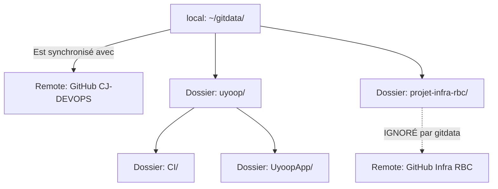

# ORGANISATION GIT ET GESTION DES DÉPÔTS

## 1. État des Lieux (Avant nettoyage)
Nous avions une structure en "Poupées Russes" instable :
- `~/gitdata/.git` (Git Géant/Monorepo).
- `~/gitdata/uyoop/.git` (Sous-projet).
- `~/gitdata/uyoop/CI/.git` (Sous-sous-projet).

**Problème** : Conflits de tracking, fichiers vus comme "supprimés" par le parent, impossibilité de gérer proprement les versions.

## 2. Nouvelle Architecture Stabilisée

Nous avons basculé sur un modèle **Monorepo Consolidé** pour le développement principal, avec des **Exceptions gérées** pour les projets infra indépendants.

### Structure des dossiers


### Détails Techniques

#### A. Le Monorepo (`~/gitdata`)
- **Remote** : `github.com:CJenkins-AFPA/CJ-DEVOPS.git`
- **Contenu** : Contient désormais TOUT le dossier `uyoop` (Application + CI + Docs).
- **Action réalisée** : Suppression des `.git` imbriqués dans `uyoop` et `CI` pour en faire de simples dossiers suivis par le parent.

#### B. L'Exception (`~/gitdata/projet-infra-rbc`)
- Ce dossier est **totalement indépendant**.
- **Configuration** : Il a été ajouté au `.gitignore` principal de `gitdata`.
- **Raison** : Il possède son propre cycle de vie et son propre dépôt GitHub. Il ne doit jamais être commité dans le Monorepo devops.

## 3. Commandes de Référence

Si vous devez cloner le projet principal demain sur une autre machine :

```bash
# Récupérer tout le travail (Uyoop + CI + Docs)
git clone git@github.com:CJenkins-AFPA/CJ-DEVOPS.git ~/gitdata

# Récupérer le projet infra (à part)
git clone git@github.com:CJenkins-AFPA/INFRA-RBC.git ~/gitdata/projet-infra-rbc
```

## 4. Note pour la CI GitLab
Bien que le code soit stocké sur GitHub (CJ-DEVOPS), nous avons utilisé un remote temporaire GitLab pour tester la CI.
Si vous relancez la CI, assurez-vous de pousser le dossier concerné vers GitLab ou de configurer un Mirroring GitHub -> GitLab.

---
*État validé le : 28 Janvier 2026*
